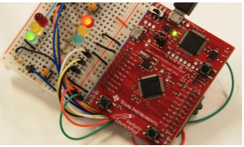

## 嵌入式开发

实验环境

使用 EK-TM4C123GXL 开发板，Keil 开发工具。

主要综合了数字逻辑，计算机组成原理，计算机体系结构以及软件开发等知识，对嵌入式设备常见的IO，器件进行熟悉设计开发。

### 实验相关

1、TM4C123GXL 开发板的熟悉

包括实验平台搭建，安装驱动，电路连接等。实现了 LED 灯的交替闪烁。

利用有限资源对实验进行扩展，实现双控开关，流水灯等。

2、解锁 GPIO，交通灯设计。

了解开发板的 GPIO，对端口进行解锁。

根据端口对应的物理地址，对寄存器进行修改，需要查阅相关资料，理解不同寄存器的功能。

