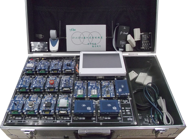

# IOT_Lab
IOT课程相关实验汇总

## 传感器网络实验

### 全功能物联网综合实验平台

**平台构成** 

ARM Cortex-A8智能终端开放式平台

IPv6/IPv4 智能网关

无线通讯模块

> Zigbee 模块组，IPv6模块组，WiFi模块组，Bluetooth模块组，RFID模块组

传感器模块

> STM8S207S8T6微控制器 + 传感器电路

### 实验项目

1、[ZigBee 入门开发](/ZigBee入门开发)

## RFID 实验

与传感器网络实验使用相同的实验平台。

### 实验项目

1、[RFID 自动读卡实验](/RFID自动读卡实验)

